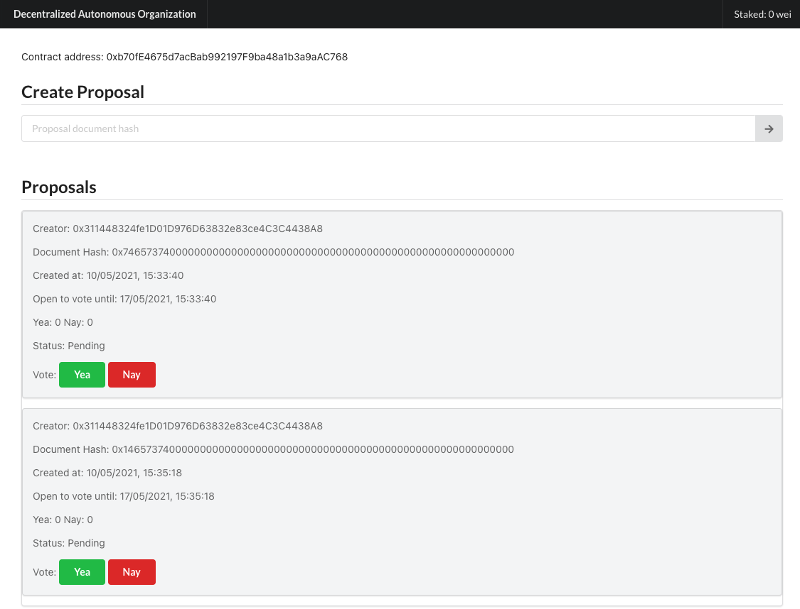

# Decentralized Autonomous Organization

## Demo
https://gallant-lichterman-19dc9a.netlify.app/

### Features
- Token owners can create proposals (min 2TKN required for creating a proposal)
- Token owners can approve or reject a proposal (weighted by the token amount)
- Revoke their approval
- Give a date for a decision deadline.

### Use cases
A decentralized autonomous organization can be useful,
- As a decision module, can help teams easily make decisions by voting.
- Can be used in a resource allocation setting, for example IoT devices that share a limited source.

